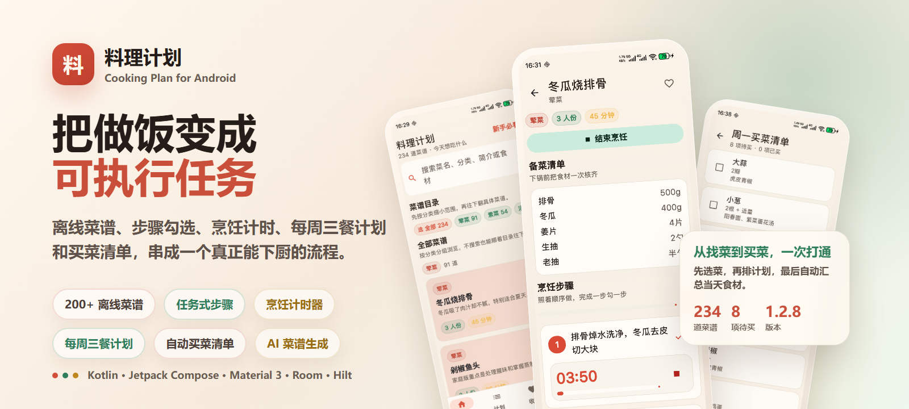
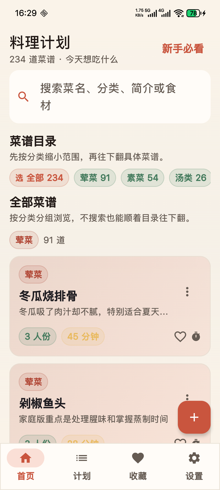
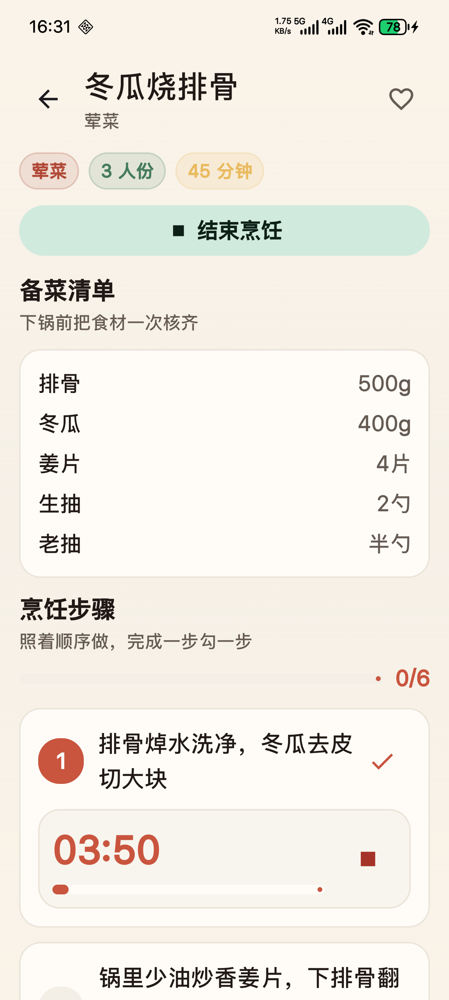
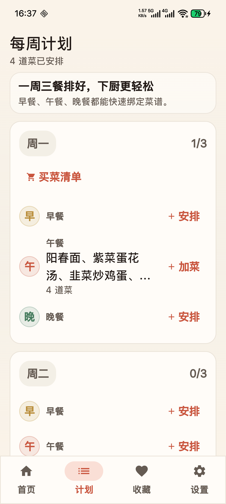
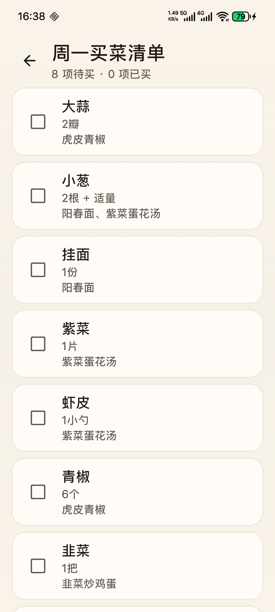
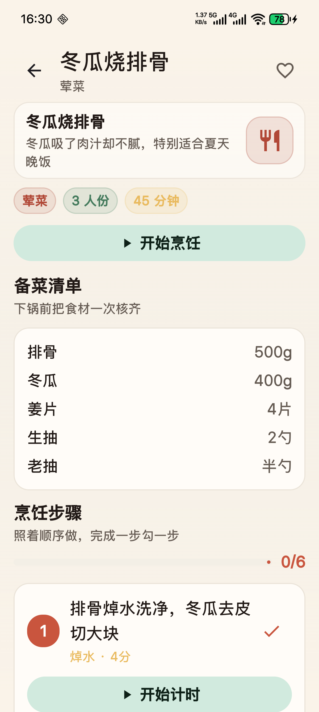
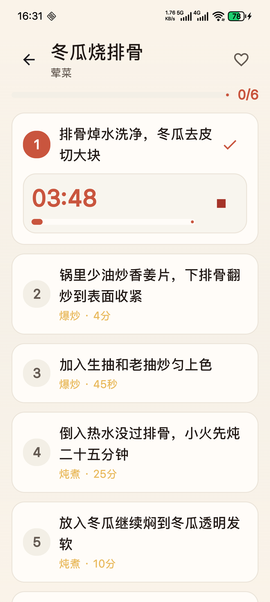
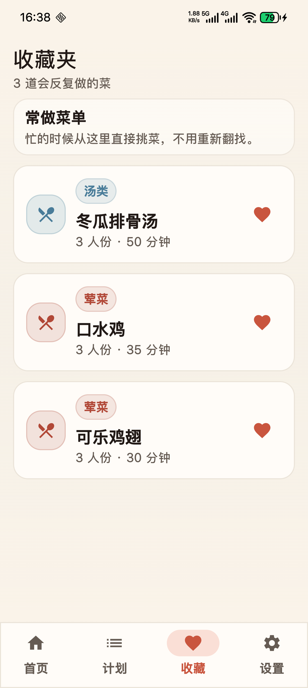
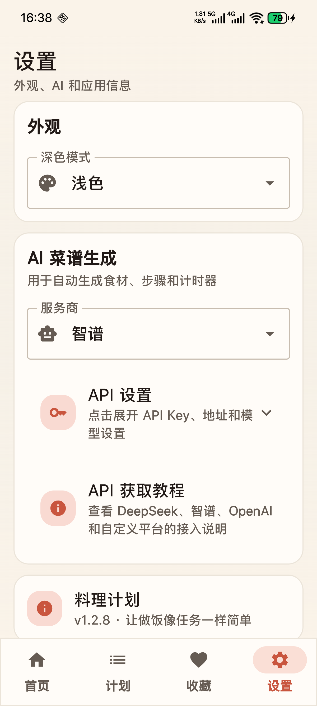

# 料理计划

<p align="center">
  
</p>

<p align="center">
  <strong>把菜谱变成任务清单、计时器、一周菜单和买菜清单的料理计划工具。</strong>
</p>

<p align="center">
  <strong>200+ 本地菜谱</strong> · <strong>离线优先</strong> · <strong>步骤打勾</strong> · <strong>烹饪计时</strong> · <strong>自动买菜清单</strong> · <strong>可选 AI 生成</strong>
</p>

<p align="center">
  <a href="./releases/料理计划-v1.2.8.apk">下载 APK</a> ·
  <a href="./CHANGELOG.md">查看更新日志</a> ·
  <a href="./LICENSE">许可证说明</a>
</p>

> 不只是“收藏菜谱”，而是把做饭这件事真正执行完。

## 这是什么

`料理计划` 是一个面向真实下厨场景的 Android 做饭助手。

它不是传统的菜谱浏览器，也不是信息流推荐工具，而是把一道菜拆成可以执行的任务流：

- 看菜谱
- 勾步骤
- 开计时
- 排一周菜单
- 自动出买菜清单

如果你做饭时经常遇到“步骤看着看着就乱了”“煮着煮着忘了时间”“买菜总少买一样”，这个项目就是为这类场景做的。

## 亮点一览

<table>
  <tr>
    <td valign="top" width="50%">
      <strong>任务式菜谱</strong><br />
      每道菜都拆成食材、步骤和进度节点。做饭时不是翻来翻去看文字，而是按步骤一路执行。
    </td>
    <td valign="top" width="50%">
      <strong>计时器直接嵌入步骤</strong><br />
      焯水、蒸、煮、焖、炖、腌制这类需要时间的动作，可以直接在菜谱流程里启动计时。
    </td>
  </tr>
  <tr>
    <td valign="top" width="50%">
      <strong>一周计划 + 自动买菜清单</strong><br />
      先排早餐、午餐、晚餐，再自动汇总食材，买菜时逐项勾选，减少遗漏和重复记忆。
    </td>
    <td valign="top" width="50%">
      <strong>离线优先</strong><br />
      除可选 AI 生成功能外，核心体验默认本地运行。不登录、无广告、数据保存在本地。
    </td>
  </tr>
</table>

<table>
  <tr>
    <td valign="top" width="50%">
      <strong>200+ 本地菜谱</strong><br />
      内置家常菜、主食、汤、甜点、凉菜、小吃等，打开就能用，不依赖先自己录入。
    </td>
    <td valign="top" width="50%">
      <strong>可选 AI 生成菜谱</strong><br />
      如果本地没有想做的菜，可以在设置里配置大模型 API。这个功能是可选项，不影响离线使用。
    </td>
  </tr>
</table>

## 适合谁

- 经常自己做饭的人
- 想提前规划一周菜单的人
- 想顺手整理买菜清单的人
- 做饭时容易忘步骤、忘计时的人
- 厨房新手，需要更清晰执行流程的人
- 喜欢离线、本地工具的人

## 怎么用

### 1. 先选菜

从首页分类里找菜，或者直接搜索菜名、分类、简介和食材。

### 2. 再安排一周菜单

把菜放进早餐、午餐、晚餐，先把这周吃什么定下来。

### 3. 做饭时按任务执行

打开菜谱后，按步骤勾选，遇到需要时间的步骤直接开计时器。

### 4. 买菜时直接看清单

系统会根据计划汇总食材，买菜时逐项勾选，减少漏买。

## 界面展示

### 主界面与核心流程

<table>
  <tr>
    <td width="50%">
      
      <p align="center"><strong>首页找菜</strong><br />分类目录和搜索并行，200+ 菜谱直接可用。</p>
    </td>
    <td width="50%">
      
      <p align="center"><strong>步骤执行</strong><br />步骤勾选和计时放在同一流程里。</p>
    </td>
  </tr>
  <tr>
    <td width="50%">
      
      <p align="center"><strong>一周计划</strong><br />先排菜单，再把菜分配到早餐、午餐、晚餐。</p>
    </td>
    <td width="50%">
      
      <p align="center"><strong>买菜清单</strong><br />按计划自动汇总食材，买菜时逐项勾选。</p>
    </td>
  </tr>
</table>

### 详情页与设置

<table>
  <tr>
    <td width="50%">
      
      <p align="center"><strong>菜谱详情</strong><br />把食材、备菜和执行信息放在一页里。</p>
    </td>
    <td width="50%">
      
      <p align="center"><strong>步骤页</strong><br />每一步都能单独执行、勾选和回看。</p>
    </td>
  </tr>
  <tr>
    <td width="50%">
      
      <p align="center"><strong>收藏页</strong><br />常做菜单独收纳，方便快速复做。</p>
    </td>
    <td width="50%">
      
      <p align="center"><strong>设置页</strong><br />配置本地偏好，也可以接入可选 AI 能力。</p>
    </td>
  </tr>
</table>

## 主要功能

- 菜谱列表浏览与搜索
- 新建、编辑、删除菜谱
- 菜谱收藏
- 食材清单
- 步骤勾选
- 步骤计时器
- 正在做菜谱入口
- 每周三餐计划
- 单餐多菜安排
- 当日买菜清单
- 采购清单
- AI 生成菜谱
- API 服务商配置
- 新手厨房指引
- 浅色 / 深色 / 跟随系统

## 安装

### 直接安装 APK

发布包位于 [releases](./releases/) 目录。

当前版本：

- `releases/料理计划-v1.2.8.apk`

如果手机里已经安装过正式版，请继续安装 `release` APK 覆盖升级，不要用 `debug` 包直接覆盖。

### 本地构建

```bash
./gradlew assembleDebug
```

正式签名构建：

```bash
./gradlew assembleRelease
```

## 技术栈

- Kotlin
- Jetpack Compose
- Material 3
- Room
- Hilt
- Navigation Compose
- kotlinx-serialization
- OkHttp

## 项目结构

```text
app/src/main/java/com/cooking/plan/
├─ data/
│  ├─ ai/          # AI 菜谱生成
│  ├─ local/       # Room 数据、默认菜谱
│  ├─ settings/    # 本地设置
│  └─ timer/       # 烹饪计时与前台服务
├─ di/             # 依赖注入
└─ ui/
   ├─ home/        # 首页与目录浏览
   ├─ plan/        # 每周计划与单餐详情
   ├─ recipe/      # 菜谱编辑 / 详情
   ├─ shopping/    # 采购清单
   ├─ favorites/   # 收藏
   ├─ guide/       # 新手指引
   └─ settings/    # 设置
```

## 路线图

- [x] 任务式菜谱
- [x] 做饭计时器
- [x] 每周三餐计划
- [x] 当日买菜清单
- [x] 200+ 默认离线菜谱
- [x] 首页分类目录
- [x] 实机截图补全 README
- [ ] 更完整的菜谱封面展示
- [ ] 更细的口味 / 难度 / 场景筛选
- [ ] 更完整的菜谱导入导出
- [ ] 更细的多菜协同做饭流程

## 更新日志

本次重点更新见 [CHANGELOG.md](./CHANGELOG.md)。

## 许可证

本项目采用非商业源码授权协议，允许学习、研究、修改和非商业分发，禁止未经授权的商业使用。

注意：由于协议禁止商业使用，它属于非商业 source-available 授权，不是 OSI 认证的开源协议。如需商业使用，需要另行取得授权。

## 致使用者

如果你也觉得做饭软件应该帮人把饭做出来，而不是只让人收藏菜谱，这个项目应该会对你有用。
